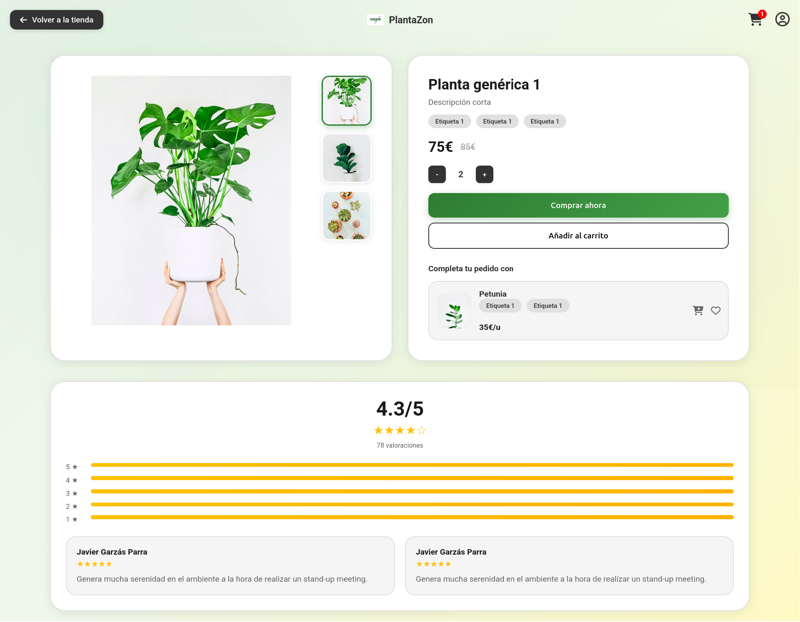
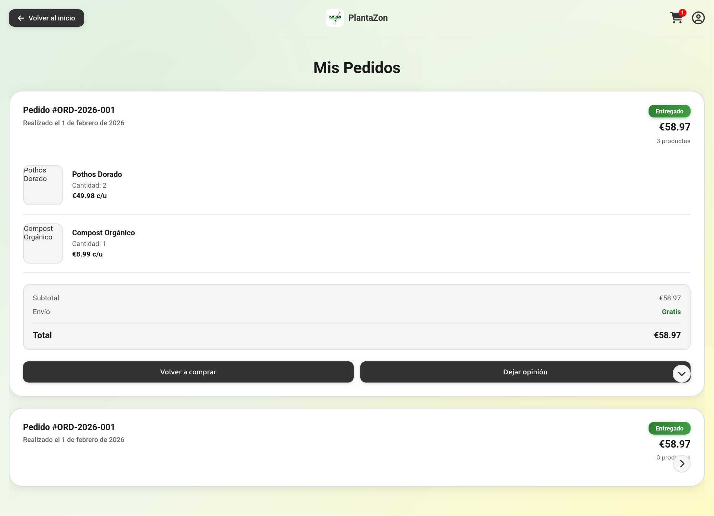
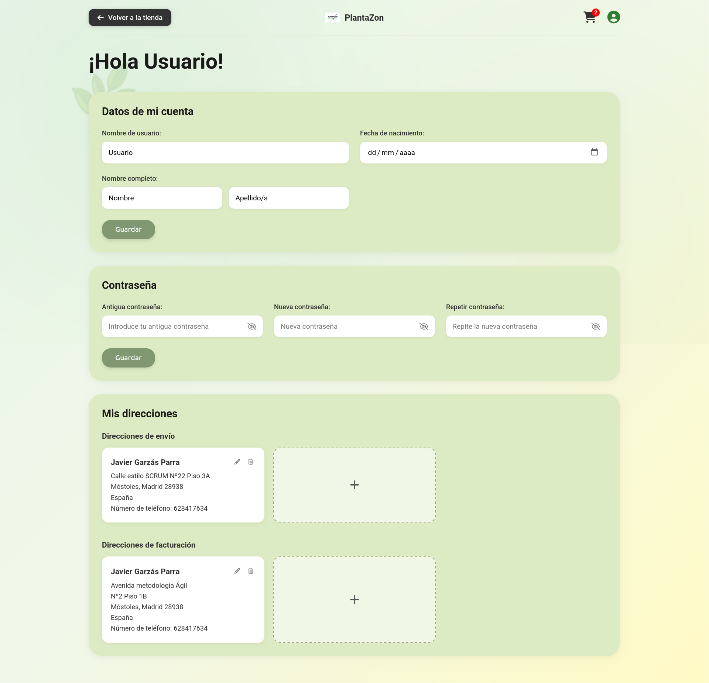
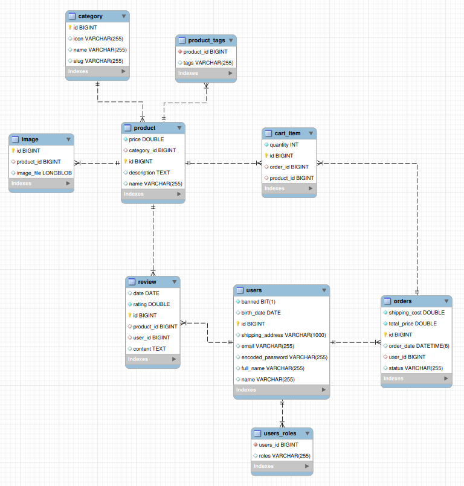

# PLANTAZON

## 👥 Miembros del Equipo
| Nombre y Apellidos | Correo URJC | Usuario GitHub |
|:--- |:--- |:--- |
| Álvaro Fuente González | a.fuente.2023@alumnos.urjc.es | alvaroSource |
| Darío García Gómez | d.garciago.2023@alumnos.urjc.es | dariogarciagomez |
| Arturo Vinuesa Domínguez | a.vinuesad.2023@alumnos.urjc.es | arturovinuesaa |
| Eduardo Fernández Sanz | e.fernandezs.2023@alumnos.urjc.es | edufdezz |

---

## 🎭 **Preparación 1: Definición del Proyecto**

### **Descripción del Tema**
La aplicación creada se trata de un e-commerce destinado a la jardinería, la aplicación muestra distintos productos de diferentes categorías a elegir de temática de jardinería y botánica.
[Escribe aquí una descripción breve y concisa de qué trata tu aplicación, el sector al que pertenece y qué valor aporta al usuario].

### **Entidades**
Indicar las entidades principales que gestionará la aplicación y las relaciones entre ellas:

1. **Usuario**
2. **Producto**
3. **Carrito**
4. **Categoría**
5. **Etiqueta**
6. **Pedido**
7. **Reseña**

**Relaciones entre entidades:**
- Usuario - Carrito: Un usuario puede tener un carrito (1:1).
- Usuario - Pedido: Un usuario puede tener varios pedidos (1:N).
- Carrito - Producto: Un carrito puede tener varios productos (1:N).
- Producto - Etiqueta: Un producto puede tener varias etiquetas y una etiqueta puede pertenecer a varios productos (N:M).
- Pedido - Producto: Un pedido puede tener varios productos (1:N).
- Categoria - Producto: Una categoría puede tener varios productos (1:N).
- Producto - Reseña: Un producto puede tener varias reseñas (1:N).
### **Permisos de los Usuarios**

* **Usuario Anónimo**: 
  - Permisos: Visualización de catálogo, búsqueda de productos, registro, gestion de productos del carrito.
  - Es dueño de su Carrito.

* **Usuario Registrado**: 
  - Permisos: Gestión de perfil, realización y gestión de pedidos, crear reseñas. 
  - Es dueño de: Sus propios Pedidos, su Perfil de Usuario, sus Reseñas.

* **Administrador**: 
  - Permisos: Gestión completa de productos (CRUD), visualización de estadísticas, moderación de contenido, gestión de usuarios.
  - Es dueño de: Productos, Categorías, puede gestionar todos los Pedidos y Usuarios

### **Imágenes**
Indicar qué entidades tendrán asociadas una o varias imágenes:

- **Usuario**: Una imagen de avatar por usuario
- **Producto**: Múltiples imágenes por producto (carrusel)
- **Reseña**: Puede tener una imagen cada reseña.

### **Gráficos**
Indicar qué información se mostrará usando gráficos y de qué tipo serán:

- **Productos más comprados**: Ventas mensuales dividas por categoría - Gráfico de tarta.
- **Productos por etiqueta**: Etiquetas más vendidas - Gráfico de tarta.
- **Ventas mensuales**: Evolución de ventas por mes - Gráfico de barras.
- **Relación visitas-compra**: Número de compras en comparación a usuarios que han visitado la página - Gráfico de líneas.
- **Gráfico de reseñas**: Reseñas de un producto a lo largo del tiempo - Gráfico de líneas.

### **Tecnología Complementaria**
Indicar qué tecnología complementaria se empleará:

- Envío de correos electrónicos automáticos mediante JavaMailSender.
- Generación de PDFs de facturas usando iText o similar.
- Sistema de autenticación OAuth2.
- Generar gráficas con JFreeChart.

### **Algoritmo o Consulta Avanzada**
Indicar cuál será el algoritmo o consulta avanzada que se implementará:

- **Algoritmo**: Sistema de recomendaciones basado en el historial de compras del usuario.
- **Descripción**: Analiza los productos comprados previamente y sugiere productos similares o complementarios basandose en las etiquetas del producto.
- **Alternativa**: Consulta compleja que agrupe ventas por reseñas.

---

## 🛠 **Preparación 2: Maquetación de páginas con HTML y CSS**

### **Vídeo de Demostración**
📹 **[Enlace al vídeo en YouTube](https://www.youtube.com/watch?v=x91MPoITQ3I)**
> Vídeo mostrando las principales funcionalidades de la aplicación web.

### **Diagrama de Navegación**
Diagrama que muestra cómo se navega entre las diferentes páginas de la aplicación:


> [Descripción opcional del flujo de navegación: Ej: "El usuario puede acceder desde la página principal a todas las secciones mediante el menú de navegación. Los usuarios anónimos solo tienen acceso a las páginas públicas, mientras que los registrados pueden acceder a su perfil y panel de usuario."]

### **Capturas de Pantalla y Descripción de Páginas**

#### **1. Página Principal / Home**


> Página de inicio que muestra el catálogo de productos con filtrado por categorías (Cuidado, Plantas, Suelo, Herramientas, Inspiración, Guardados). Incluye barra lateral de navegación, barra de búsqueda superior y acceso al carrito y perfil de usuario. Los productos se muestran en tarjetas con imagen, nombre, precio y opción de añadir al carrito.

#### **2. Página de Inicio de Sesión / Login**


> Página de autenticación que permite a los usuarios iniciar sesión o registrarse en la aplicación. Incluye formularios con validación para email y contraseña, opción de suscripción a novedades, y una interfaz con pestañas deslizantes para alternar entre inicio de sesión y registro.

#### **3. Página de Detalle de Producto**


> Página que muestra información detallada de un producto específico: galería de imágenes con navegación por puntos, información del producto (nombre, descripción, etiquetas, precio con descuento), selector de cantidad, botones de compra y añadir al carrito. Incluye sección de productos recomendados y valoraciones de usuarios con gráficos de barras y comentarios.

#### **4. Página del Carrito**


> Página que muestra el carrito de compra con los productos seleccionados. Cada producto incluye imagen, nombre, tamaño, precio, controles de cantidad y opción de eliminar. Panel lateral con resumen del pedido (subtotal, envío, total) y botón para tramitar el pedido.

#### **5. Página de Pedidos**


> Página que muestra el historial de pedidos del usuario. Cada pedido incluye número de orden, fecha, estado (entregado, en proceso, etc.), precio total, cantidad de productos y botón expandible para ver detalles. Los detalles incluyen imágenes de productos, cantidades, precios individuales, resumen con subtotal y envío, y opciones para volver a comprar o dejar opinión.

#### **6. Página de Perfil de Usuario**


> Página de gestión del perfil del usuario que permite editar datos personales (nombre de usuario, correo, contraseña, dirección de envío) y configurar preferencias de cuenta (notificaciones por email, modo oscuro, recibir ofertas). Incluye botones para guardar cambios o eliminar cuenta.

#### **7. Página de Administrador**


> Panel de administración que permite gestionar productos (añadir, modificar, eliminar), visualizar estadísticas de ventas mediante gráficos, gestionar usuarios y moderar contenido. Incluye barra de búsqueda para productos y acceso rápido a todas las funcionalidades administrativas.

---

## 🛠 **Práctica 1: Web con HTML generado en servidor y AJAX**

### **Vídeo de Demostración**
📹 **[Enlace al vídeo en YouTube](https://youtu.be/UTMMdqvSfkI)**
> Vídeo mostrando las principales funcionalidades de la aplicación web.

### **Navegación y Capturas de Pantalla**

#### **Diagrama de Navegación**


#### **Capturas de Pantalla Actualizadas**

**1. Páginas de administrador**  
> La página de administrador fue dividida en dos para poder diferenciar gestión de usuarios y gestión de productos.

**1.1 Sección de administrador**  
  
> Página de administración que permite visualizar estadísticas mediante gráficos y gestionar usuarios y moderar contenido.

**1.2 Gestor de productos**  
  
> Página de administración en la que se pueden añadir nuevos productos, gestionar categorías (añadirlas, quitarlas y editarlas) y gestionar productos. 


### **Instrucciones de Ejecución**

#### **Requisitos Previos**
- **Java**: versión 21 o superior
- **Maven** + **Springboot**: versión 3.8 o superior
- **MySQL**: versión 8.0 o superior
- **Git**: para clonar el repositorio

#### **Pasos para ejecutar la aplicación**

1.**Clonar el repositorio**
   ```bash
   git clone https://github.com/CodeURJC-DAW-2025-26/practica-daw-2025-26-grupo-4.git
   cd practica-daw-2025-26-grupo-4
   ```

2.**Abrir el proyecto en VSCode**
  - Abre la carpeta del proyecto en VSCode.  
  - Navega a la clase principal del proyecto:
    src\main\java\es\urjc\daw04\Daw04Application.java

3.**Ejecutar la aplicación**
  - Haz clic derecho sobre `DAW04Application.java` → **Run 'DAW04Application.main()'**  
  o abre la clase y pulsa **Run Main** en la parte superior.  
  - VSCode iniciará el servidor Spring Boot y mostrará los logs en la terminal integrada.
  - Nosotros hemos usado también la extensión Spring Boot Dashboard en vscode para facilitar la ejecución.

4.**Abrir en navegador**
https://localhost:8443

#### **Credenciales de prueba**
- **Usuario Admin**: usuario: `admin`, contraseña: `admin`
- **Usuario Registrado**: usuario: `user`, contraseña: `user`

### **Diagrama de Entidades de Base de Datos**

Diagrama mostrando las entidades, sus campos y relaciones:



Diagrama de clases de la aplicación con diferenciación por colores o secciones:

  

> Este diagrama detalla las clases principales del backend y frontend, incluyendo controladores, servicios y templates HTML asociados a cada funcionalidad.

### Participación de Miembros en la Práctica 1

#### Alumno 1 - Álvaro Fuente Gonzalez

Responsable de las funcionalidades de administración de productos, sistema de recomendaciones, correcciones de idioma y actualización de fragmentos AJAX.

| Nº | Commits | Files |
|----|---------|-------|
|1| [Recommendations page and algorithm implemented](https://github.com/CodeURJC-DAW-2025-26/practica-daw-2025-26-grupo-4/commit/7f1e8d1) | RecommendationController.java, RecommendationPack.java, CartItemRepository.java, OrderRepository.java‎, RecommendationService.java |‎
|2| [Edit product fix](https://github.com/CodeURJC-DAW-2025-26/practica-daw-2025-26-grupo-4/commit/49458bc) | AdminController.java |
|3| [Updated ajax fragments](https://github.com/CodeURJC-DAW-2025-26/practica-daw-2025-26-grupo-4/commit/32d93eb) | admin-users.html, reviews.html |‎
|4| [Language fix](https://github.com/CodeURJC-DAW-2025-26/practica-daw-2025-26-grupo-4/commit/d403b59) | AdminController.java, AuthController.java, CustomErrorController.java, ShopController.java‎
, ProductRepository.java, RepositoryUserDetailsService.java‎, CartService.java, EmailService.java, ImageService.java‎, login.js, pagination.js, user.js |
|5| [Translations fix](https://github.com/CodeURJC-DAW-2025-26/practica-daw-2025-26-grupo-4/commit/d6c2c00) | Order.java‎, Product.java, Review.java, User.java |

---

#### Alumno 2 - Darío García Gómez

Responsable del servicio de pedidos, integración con Stripe, gráficas del admin, traducciones y gestión de reseñas con usuarios eliminados.

| Nº | Commits | Files |
|----|---------|-------|
|1| [Order service & Stripe integration](https://github.com/CodeURJC-DAW-2025-26/practica-daw-2025-26-grupo-4/commit/b118159) | pom.xml, AdminController.java, AuthController.java, ShopController.java, CartItem.java, Order.java, OrderRepository.java, OrderService.java, SampleDataService.java, StripeService.java, application.properties |
|2| [Graphics and charts](https://github.com/CodeURJC-DAW-2025-26/practica-daw-2025-26-grupo-4/commit/e627acb) | AdminController.java, Review.java, OrderRepository.java, ReviewRepository.java, OrderService.java, ReviewService.java, admin.html |
|3| [Reviews in database and user samples](https://github.com/CodeURJC-DAW-2025-26/practica-daw-2025-26-grupo-4/commit/eb66420) | ShopController.java, Product.java, Review.java, SampleDataService.java, UserService.java, application.properties, product.html |
|4| [Review redirection fix](https://github.com/CodeURJC-DAW-2025-26/practica-daw-2025-26-grupo-4/commit/b4704eb) | AuthController.java, GlobalModelAdvice.java, ShopController.java, WebSecurityConfig.java, login.css, header.html, login.html |
|5| [Translations](https://github.com/CodeURJC-DAW-2025-26/practica-daw-2025-26-grupo-4/commit/66ce1e0) | login.html, order.html, product.html |

---

#### Alumno 3 - Eduardo Fernández Sanz

Responsable de la lógica de carrito, pedidos, reseñas y correcciones generales de frontend.

| Nº | Commits | Files |
|----|---------|-------|
|1| [Implemented add a review function](https://github.com/CodeURJC-DAW-2025-26/practica-daw-2025-26-grupo-4/commit/3282c7f) | AdminController.java, ShopController.java, Product.java, ReviewRepository.java, WebSecurityConfig.java, ReviewService.java, order.js, order.css, product.css, fragments/orders.html, order.html, product.html |
|2| [Fixed order page access](https://github.com/CodeURJC-DAW-2025-26/practica-daw-2025-26-grupo-4/commit/0d8b94d) | ShopController.java, WebSecurityConfig.java, cart.html, order.html |
|3| [Address form](https://github.com/CodeURJC-DAW-2025-26/practica-daw-2025-26-grupo-4/commit/6632b24) | AuthController.java, User.java, WebSecurityConfig.java, user.js, user.css, user.html
|4| [Search and footer fixes](https://github.com/CodeURJC-DAW-2025-26/practica-daw-2025-26-grupo-4/commit/700e886) | HomeController.java, ProductRepository.java, ProductService.java, components.css, home.css, cart.html, home.html, login.html, order.html, product.html, user.html |
|5| [Random product suggestion](https://github.com/CodeURJC-DAW-2025-26/practica-daw-2025-26-grupo-4/commit/257716b) | ShopController.java |

---

#### Alumno 4 - Arturo Vinuesa Dominguez

Responsable de seguridad, autenticación, usuarios y control de acceso.

| Nº | Commits | Files |
|----|---------|-------|
|1| [Admin can ban and edit users](https://github.com/CodeURJC-DAW-2025-26/practica-daw-2025-26-grupo-4/commit/b957e2d) | AdminController.java, User.java, RepositoryUserDetailsService.java, admin.css, admin.html |
|2| [User screen and password change](https://github.com/CodeURJC-DAW-2025-26/practica-daw-2025-26-grupo-4/commit/56783e3) | AuthController.java, user.html |
|3| [Welcome email on register](https://github.com/CodeURJC-DAW-2025-26/practica-daw-2025-26-grupo-4/commit/7c48375) | EmailService.java, AuthController.java, pom.xml, application.properties, login.html |
|4| [User registration and login](https://github.com/CodeURJC-DAW-2025-26/practica-daw-2025-26-grupo-4/commit/6b0238e) | AuthController.java, WebSecurityConfig.java, SampleDataService.java, login.css, header.html, login.html |
|5| [Security database](https://github.com/CodeURJC-DAW-2025-26/practica-daw-2025-26-grupo-4/commit/f80e99e) | pom.xml, AuthController.java, User.java, UserRepository.java, CSRFHandlerConfiguration.java, RepositoryUserDetailsService.java, WebSecurityConfig.java, UserService.java (eliminado) |
---

## 🛠 **Práctica 2: Incorporación de una API REST a la aplicación web, despliegue con Docker y despliegue remoto**

### **Vídeo de Demostración**
📹 **[Enlace al vídeo en YouTube](https://www.youtube.com/watch?v=x91MPoITQ3I)**
> Vídeo mostrando las principales funcionalidades de la aplicación web.

### **Documentación de la API REST**

#### **Especificación OpenAPI**
📄 **[Especificación OpenAPI (YAML)](/api-docs/api-docs.yaml)**

#### **Documentación HTML**
📖 **[Documentación API REST (HTML)](https://raw.githack.com/[usuario]/[repositorio]/main/api-docs/api-docs.html)**

> La documentación de la API REST se encuentra en la carpeta `/api-docs` del repositorio. Se ha generado automáticamente con SpringDoc a partir de las anotaciones en el código Java.

### **Diagrama de Clases y Templates Actualizado**

Diagrama actualizado incluyendo los @RestController y su relación con los @Service compartidos:


### **Instrucciones de Ejecución con Docker**

#### **Requisitos previos:**
- Docker instalado (versión 20.10 o superior)
- Docker Compose instalado (versión 2.0 o superior)

#### **Pasos para ejecutar con docker-compose:**

1. **Clonar el repositorio** (si no lo has hecho ya):
   ```bash
   git clone https://github.com/[usuario]/[repositorio].git
   cd [repositorio]
   ```

2. **AQUÍ LOS SIGUIENTES PASOS**:

### **Construcción de la Imagen Docker**

#### **Requisitos:**
- Docker instalado en el sistema

#### **Pasos para construir y publicar la imagen:**

1. **Navegar al directorio de Docker**:
   ```bash
   cd docker
   ```

2. **AQUÍ LOS SIGUIENTES PASOS**

### **Despliegue en Máquina Virtual**

#### **Requisitos:**
- Acceso a la máquina virtual (SSH)
- Clave privada para autenticación
- Conexión a la red correspondiente o VPN configurada

#### **Pasos para desplegar:**

1. **Conectar a la máquina virtual**:
   ```bash
   ssh -i [ruta/a/clave.key] [usuario]@[IP-o-dominio-VM]
   ```
   
   Ejemplo:
   ```bash
   ssh -i ssh-keys/app.key vmuser@10.100.139.XXX
   ```

2. **AQUÍ LOS SIGUIENTES PASOS**:

### **URL de la Aplicación Desplegada**

🌐 **URL de acceso**: `https://[nombre-app].etsii.urjc.es:8443`

#### **Credenciales de Usuarios de Ejemplo**

| Rol | Usuario | Contraseña |
|:---|:---|:---|
| Administrador | admin | admin123 |
| Usuario Registrado | user1 | user123 |
| Usuario Registrado | user2 | user123 |

### **Participación de Miembros en la Práctica 2**

#### **Alumno 1 - [Nombre Completo]**

[Descripción de las tareas y responsabilidades principales del alumno en el proyecto]

| Nº    | Commits      | Files      |
|:------------: |:------------:| :------------:|
|1| [Descripción commit 1](URL_commit_1)  | [Archivo1](URL_archivo_1)   |
|2| [Descripción commit 2](URL_commit_2)  | [Archivo2](URL_archivo_2)   |
|3| [Descripción commit 3](URL_commit_3)  | [Archivo3](URL_archivo_3)   |
|4| [Descripción commit 4](URL_commit_4)  | [Archivo4](URL_archivo_4)   |
|5| [Descripción commit 5](URL_commit_5)  | [Archivo5](URL_archivo_5)   |

---

#### **Alumno 2 - [Nombre Completo]**

[Descripción de las tareas y responsabilidades principales del alumno en el proyecto]

| Nº    | Commits      | Files      |
|:------------: |:------------:| :------------:|
|1| [Descripción commit 1](URL_commit_1)  | [Archivo1](URL_archivo_1)   |
|2| [Descripción commit 2](URL_commit_2)  | [Archivo2](URL_archivo_2)   |
|3| [Descripción commit 3](URL_commit_3)  | [Archivo3](URL_archivo_3)   |
|4| [Descripción commit 4](URL_commit_4)  | [Archivo4](URL_archivo_4)   |
|5| [Descripción commit 5](URL_commit_5)  | [Archivo5](URL_archivo_5)   |

---

#### **Alumno 3 - [Nombre Completo]**

[Descripción de las tareas y responsabilidades principales del alumno en el proyecto]

| Nº    | Commits      | Files      |
|:------------: |:------------:| :------------:|
|1| [Descripción commit 1](URL_commit_1)  | [Archivo1](URL_archivo_1)   |
|2| [Descripción commit 2](URL_commit_2)  | [Archivo2](URL_archivo_2)   |
|3| [Descripción commit 3](URL_commit_3)  | [Archivo3](URL_archivo_3)   |
|4| [Descripción commit 4](URL_commit_4)  | [Archivo4](URL_archivo_4)   |
|5| [Descripción commit 5](URL_commit_5)  | [Archivo5](URL_archivo_5)   |

---

#### **Alumno 4 - [Nombre Completo]**

[Descripción de las tareas y responsabilidades principales del alumno en el proyecto]

| Nº    | Commits      | Files      |
|:------------: |:------------:| :------------:|
|1| [Descripción commit 1](URL_commit_1)  | [Archivo1](URL_archivo_1)   |
|2| [Descripción commit 2](URL_commit_2)  | [Archivo2](URL_archivo_2)   |
|3| [Descripción commit 3](URL_commit_3)  | [Archivo3](URL_archivo_3)   |
|4| [Descripción commit 4](URL_commit_4)  | [Archivo4](URL_archivo_4)   |
|5| [Descripción commit 5](URL_commit_5)  | [Archivo5](URL_archivo_5)   |

---

## 🛠 **Práctica 3: Implementación de la web con arquitectura SPA**

### **Vídeo de Demostración**
📹 **[Enlace al vídeo en YouTube](URL_del_video)**
> Vídeo mostrando las principales funcionalidades de la aplicación web.

### **Preparación del Entorno de Desarrollo**

#### **Requisitos Previos**
- **Node.js**: versión 18.x o superior
- **npm**: versión 9.x o superior (se instala con Node.js)
- **Git**: para clonar el repositorio

#### **Pasos para configurar el entorno de desarrollo**

1. **Instalar Node.js y npm**
   
   Descarga e instala Node.js desde [https://nodejs.org/](https://nodejs.org/)
   
   Verifica la instalación:
   ```bash
   node --version
   npm --version
   ```

2. **Clonar el repositorio** (si no lo has hecho ya)
   ```bash
   git clone https://github.com/[usuario]/[nombre-repositorio].git
   cd [nombre-repositorio]
   ```

3. **Navegar a la carpeta del proyecto React**
   ```bash
   cd frontend
   ```

4. **AQUÍ LOS SIGUIENTES PASOS**

### **Diagrama de Clases y Templates de la SPA**

Diagrama mostrando los componentes React, hooks personalizados, servicios y sus relaciones:


### **Participación de Miembros en la Práctica 3**

#### **Alumno 1 - [Nombre Completo]**

[Descripción de las tareas y responsabilidades principales del alumno en el proyecto]

| Nº    | Commits      | Files      |
|:------------: |:------------:| :------------:|
|1| [Descripción commit 1](URL_commit_1)  | [Archivo1](URL_archivo_1)   |
|2| [Descripción commit 2](URL_commit_2)  | [Archivo2](URL_archivo_2)   |
|3| [Descripción commit 3](URL_commit_3)  | [Archivo3](URL_archivo_3)   |
|4| [Descripción commit 4](URL_commit_4)  | [Archivo4](URL_archivo_4)   |
|5| [Descripción commit 5](URL_commit_5)  | [Archivo5](URL_archivo_5)   |

---

#### **Alumno 2 - [Nombre Completo]**

[Descripción de las tareas y responsabilidades principales del alumno en el proyecto]

| Nº    | Commits      | Files      |
|:------------: |:------------:| :------------:|
|1| [Descripción commit 1](URL_commit_1)  | [Archivo1](URL_archivo_1)   |
|2| [Descripción commit 2](URL_commit_2)  | [Archivo2](URL_archivo_2)   |
|3| [Descripción commit 3](URL_commit_3)  | [Archivo3](URL_archivo_3)   |
|4| [Descripción commit 4](URL_commit_4)  | [Archivo4](URL_archivo_4)   |
|5| [Descripción commit 5](URL_commit_5)  | [Archivo5](URL_archivo_5)   |

---

#### **Alumno 3 - [Nombre Completo]**

[Descripción de las tareas y responsabilidades principales del alumno en el proyecto]

| Nº    | Commits      | Files      |
|:------------: |:------------:| :------------:|
|1| [Descripción commit 1](URL_commit_1)  | [Archivo1](URL_archivo_1)   |
|2| [Descripción commit 2](URL_commit_2)  | [Archivo2](URL_archivo_2)   |
|3| [Descripción commit 3](URL_commit_3)  | [Archivo3](URL_archivo_3)   |
|4| [Descripción commit 4](URL_commit_4)  | [Archivo4](URL_archivo_4)   |
|5| [Descripción commit 5](URL_commit_5)  | [Archivo5](URL_archivo_5)   |

---

#### **Alumno 4 - [Nombre Completo]**

[Descripción de las tareas y responsabilidades principales del alumno en el proyecto]

| Nº    | Commits      | Files      |
|:------------: |:------------:| :------------:|
|1| [Descripción commit 1](URL_commit_1)  | [Archivo1](URL_archivo_1)   |
|2| [Descripción commit 2](URL_commit_2)  | [Archivo2](URL_archivo_2)   |
|3| [Descripción commit 3](URL_commit_3)  | [Archivo3](URL_archivo_3)   |
|4| [Descripción commit 4](URL_commit_4)  | [Archivo4](URL_archivo_4)   |
|5| [Descripción commit 5](URL_commit_5)  | [Archivo5](URL_archivo_5)   |

